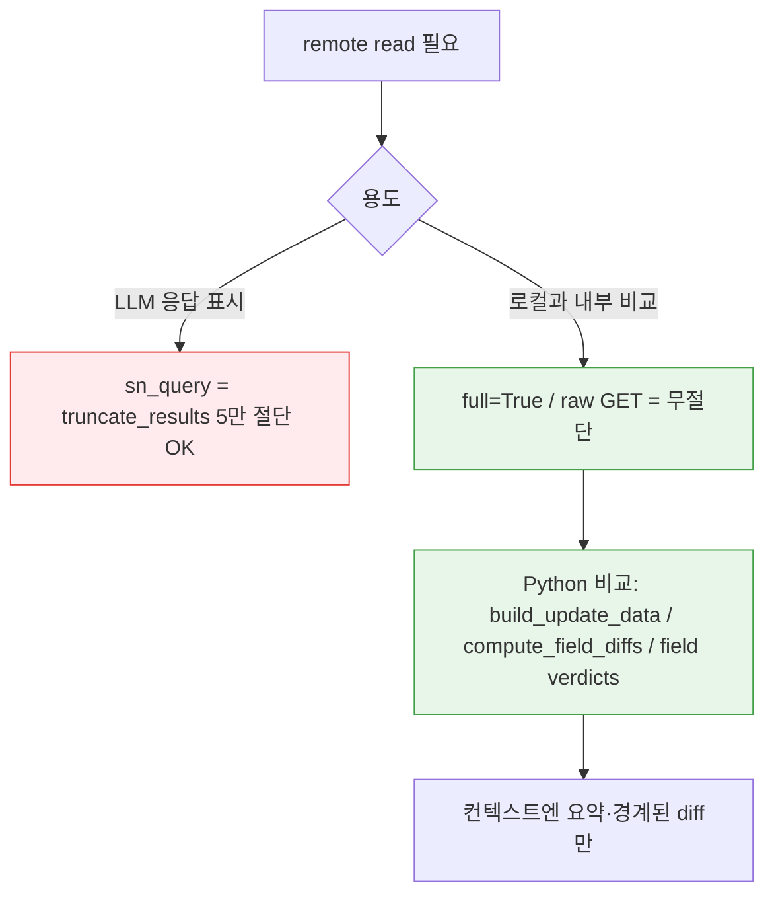
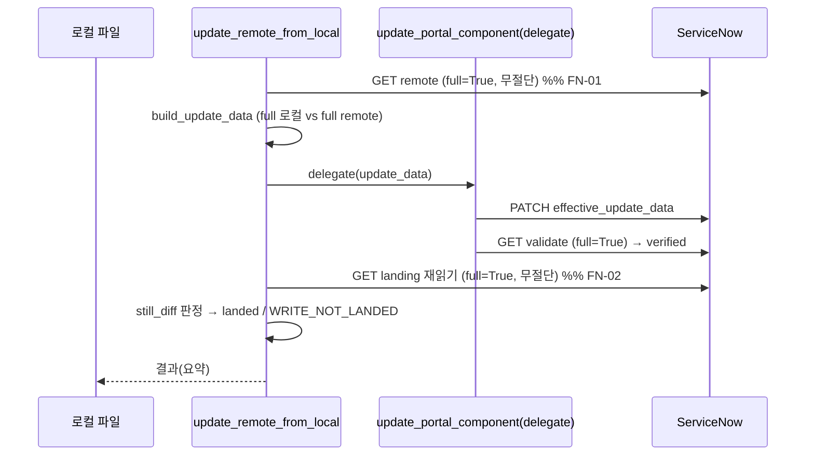

# PLAN: mcp_untruncated_remote_compare · v1

| 상태 | 작성 | 대상 | 법인 | 범위 | 근거 커밋 |
|---|---|---|---|---|---|
| 검토중 | 2026-07-15 | MCP 서버 sync/portal 도구 | 해당 없음 (오픈소스 MCP 코드) | 표준 | 360480b + 미커밋 |

> **한 줄 요약**: LLM 컨텍스트 보호용 5만 자 절단(`truncate_results`)이 push·preview·analyze·verdict의 **내부 소스 비교 경로**에 새어 들어가, full 로컬을 절단된 remote와 비교해 가짜 `CONFLICT`/`WRITE_NOT_LANDED`를 내던 것을, 비교 read를 전부 무절단(`full=True`/raw GET)으로 통일해 제거한다.

> 목차: 1 배경 · 2 목표·비목표 · 3 요구사항 · 4 설계 개요 · 5 상세 설계 ·
> 6 현행 근거 · 7 대안 검토 · 8 구현 계획 · 9 검증 · 10 리스크·미결

---

## 1. 배경 & 문제 (Why)

- **현재 상황**: 포털 위젯 소스를 로컬에서 편집→`update_remote_from_local`로 push하는 워크플로. 서버 본문 비교는 `_fetch_portal_component_record`로 remote를 읽어 로컬 파일과 대조한다.
- **문제·필요**:
  - `diff_local_component`는 remote를 `full=True`(raw GET, 무절단)로 읽는데, `update_remote_from_local`은 **`full=True` 없이** 읽어 `sn_query`의 `truncate_results`(5만 자 초과 필드 절단, `sn_api.py:76-114`)를 탄다.
  - 그 결과 **5만 자 초과 필드**(대형 위젯 `client_script`/`script`)에서 full 로컬 vs 절단 remote를 비교 → 가짜 `~100% 교체 CONFLICT`, 가짜 `WRITE_NOT_LANDED`가 발생. 실제로는 landing 됐는데 실패로 보고되어 사용자가 재시도·`force`로 헤맴.
  - 같은 절단 함정이 `preview_portal_component_update`(사용자-대면 diff), `analyze_portal_component_update`(변경 요약), verdict scan의 `_fetch_records_chunk` fallback에도 존재.
- **입력 근거**:
  - 지시문: "관련툴의 모든 문제들 정리하자 / 로그 분석 먼저 / 명명백백"
  - 라이브 로그: `~/.mfa_servicenow_mcp/servicenow-mcp_<instance>.*.log` (회사명 포함 — 코드/커밋 비반영)
  - 원 대화의 증상: diff=2922줄 vs push=1408줄, "dev 50040바이트"

> **결정적 증거 (산술)**: `truncate_results`는 `value[:50000] + "... (truncated, original length: 108076)"`를 만든다. suffix가 **정확히 40자** → **50000 + 40 = 50040**. 즉 "dev 50040바이트/1408줄"은 서버 실제 크기가 아니라 **절단본**이고, 로컬 108076바이트가 진짜 본문, diff의 2922줄이 진짜였다. **로컬 doubling은 없었다.**

## 2. 목표 & 비목표 (Goals / Non-Goals)

- **목표**
  - push의 remote 비교 read(pre-push 게이트 + landing 검증)를 무절단으로 통일해, 5만 자 초과 필드의 가짜 `CONFLICT`/`WRITE_NOT_LANDED`를 제거한다.
  - 사용자-대면 비교 도구(preview/analyze)와 verdict fallback도 동일 원칙(무절단 비교)으로 정리한다.
  - "전체 비교는 Python에서, 컨텍스트엔 요약만" 원칙을 코드로 못박고 회귀 테스트로 고정한다.
- **비목표 (Non-Goals)**
  - `truncate_results` 자체(LLM 응답 컨텍스트 보호)는 **변경하지 않는다** — 절단은 LLM-대면 응답엔 필요하다. 내부 비교 경로에서만 우회한다.
  - `update_portal_component`의 초기 current read는 **의도적으로 건드리지 않는다**(§7 대안 참조).
  - sp_* Service Portal의 **진짜 silent non-landing**은 이번 범위 밖(별개 현상, §10-3).
  - `auth_manager.py` 클래스 코어는 FROZEN — 무관.
- **성공 기준**: 5만 자 초과 필드를 push해도 delegate 검증과 caller landing 검증이 일치하고, 전체 테스트 스위트가 통과한다.

## 3. 요구사항 (What)

| 기능 ID | 기능 | 조건(트리거) | 결과(기대 동작) | 우선순위 |
|---|---|---|---|---|
| FN-mcp_untruncated-01 | push 사전 게이트 무절단 read | `update_remote_from_local` 진입, remote body 필요 | `_fetch_portal_component_record(..., full=True)`로 읽어 절단 없이 로컬과 비교 | [필수] |
| FN-mcp_untruncated-02 | push landing 검증 무절단 read | PATCH 성공 후 재읽기 | 무절단으로 재읽어 `still_diff` 판정 — 5만 초과 필드도 정확히 landing 판정 | [필수] |
| FN-mcp_untruncated-03 | verdict fallback 무절단 fetch | Batch API 미지원으로 per-chunk fallback | `_fetch_records_chunk`가 raw GET으로 무절단 fetch, 실패 청크는 graceful degrade | [필수] |
| FN-mcp_untruncated-04 | preview diff 무절단 | `preview_portal_component_update` 호출 | current를 무절단으로 읽어 before/after diff·길이 계산 (표시 경계는 별도 유지) | [필수] |
| FN-mcp_untruncated-05 | analyze 요약 무절단 | `analyze_portal_component_update` 호출 | current를 무절단으로 읽어 change summary(변경 여부/길이/delta) 정확화 | [검토] |
| FN-mcp_untruncated-06 | 불변식 회귀 테스트 | 테스트 실행 | push가 `full=True`로 안 읽으면 실패하는 테스트 존재 | [필수] |

- **제약·전제**: `_fetch_portal_component_record(full=True)`는 raw GET 실패 시 `sn_query`로 폴백(ACL 케이스 보존, `portal_tools.py:286-290`). 표시 경계(`_summarize_text_preview`, `MAX_DIFF_LINES`)는 유지되어 컨텍스트 폭주는 여전히 방지된다.

## 4. 설계 개요 (Solution Overview)

- **접근 요약**: remote를 "LLM에 보여줄 용도"로 읽는 경로(절단 OK)와 "로컬과 비교할 용도"로 읽는 경로(절단 금지)를 분리한다. 후자를 전부 `full=True`(raw GET) 또는 raw make_request로 통일한다. 비교·diff는 Python에서 수행하고, 컨텍스트로 나가는 산출물만 표시 경계로 자른다.

## 5. 상세 설계 (How)

- **처리 시퀀스 (push, 수정 후)**:

- **데이터 설계**:
  - `truncate_results(max_len=50000)` (`sn_api.py:76-114`) — 변경 없음. 5만 자 초과 문자열 필드에 `"... (truncated, original length: N)"` suffix 부착.
  - `_fetch_portal_component_record(full=True)` → `_direct()` raw GET(`portal_tools.py:267-283`), 실패 시 `sn_query` 폴백.
  - `_fetch_records_chunk` → `_table_chunk_url`로 상대 URL 생성, `auth_manager.make_request("GET")` 직접 호출, `resp.json()["result"]` 무절단.
- **예외 처리**:
  - verdict fallback 청크 fetch가 HTTP≥400이면 `ValueError` → 호출부(`sync_tools.py:1638-1649`)에서 catch → 해당 청크만 빈 결과 → 기존 `missing_remote` 경로로 강등(스캔 전체 중단 금지).
  - push의 `full=True` raw GET이 ACL로 막히면 `sn_query` 폴백(기존 동작 보존).

## 6. 현행 근거 (Evidence)

- **로컬 소스**:
  - `sn_api.py:76-114` `truncate_results` — 5만 자 절단 + 40자 suffix (50040 산술의 근원).
  - `sn_api.py:317-348` `sn_query_page` — TTL 쿼리 캐시.
  - `portal_tools.py:246-305` `_fetch_portal_component_record` — `full=True`=raw GET, 아니면 절단 sn_query.
  - `sync_tools.py:1717` `diff_local_component` → `:1765` `full=True` (정상 기준선).
  - `sync_tools.py:1968` `update_remote_from_local` → 수정 전 `:2068`/`:2400` 무 `full` (버그).
  - `sync_tools.py:1890-1955` `_compute_field_diffs`/`_build_update_data_and_magnitude` — 비교는 이미 Python(EOL 정규화). 문제는 입력 remote가 절단이었던 것.
- **시스템 설정 / 도구**: 사용 도구 — 로그 grep, 로컬 파일 stat, `get_portal_component_code`(라이브 read 시도).
- **DB 데이터 / 로그 증거** (`~/.mfa_servicenow_mcp/*.log`):
  - `~100% of the lines` 교체 14회, `WRITE_NOT_LANDED` 다수(`script`/`client_script`).
  - `truncated, original length` / `Response truncated` notice = **0건** (절단본은 tool 결과 직렬화에 안 실림 — body 미echo).
  - `landing_widget`: client_script 49206 / script 48423 바이트 (5만 경계 → 편집으로 초과 시 절단) = 원 대화의 그 레코드.
  - `newbpmcommonattachment`: client_script 18219 / script 10949 바이트 (5만 미만) — WRITE_NOT_LANDED가 간헐 발생 = **절단 아님, 별개 현상**.
- **충돌·확인 불가**: `newbpmcommonattachment`(18KB)의 landing 실제 여부는 라이브 대조 미완(세션 MCP가 sys_id 미발견 — instance 불일치 추정). §10로 분리.

## 7. 대안 검토 (Alternatives)

| 대안 | 장점 | 단점 | 채택? |
|---|---|---|---|
| A. 비교 read를 `full=True`/raw GET로 통일 (채택) | 최소 diff, `diff_local_component`과 대칭, 절단 정책 불변 | 비교 read가 sn_query 캐시 미사용(라운드트립 약간↑) | O |
| B. `truncate_results` max_len 상향/해제 | 단순 | LLM-대면 응답 컨텍스트 폭주 위험, 근본 오설계(표시 절단이 비교에 침투) 방치 | X — 컨텍스트 안전 훼손 |
| C. `update_portal_component` 초기 read도 `full=True` | 완전 일관 | 실질 영향은 "변경 없는 >5만 필드의 불필요 재기록"뿐(잘못된 write 없음)인데 테스트 11개 파손 | X — 비용>효과, 이번 제외 |
| D. sn_query에 `no_truncate` 플래그 추가 | 명시적 | 신규 API 표면, 호출부 전수 수정 필요 | X — 과설계 |

## 8. 구현 계획 (WBS)

| 작업 ID | 구분 | 대상 | 파일 | 구현 지시 | 확인 기준 | 선행 조건 |
|---|---|---|---|---|---|---|
| WBS-mcp_untruncated-01 | 수정 | push 사전 게이트 | `sync_tools.py:2061-2068` | remote fetch에 `full=True` + 사유 주석 | 무절단 비교 | - |
| WBS-mcp_untruncated-02 | 수정 | push landing 검증 | `sync_tools.py:2396-2400` | 재읽기에 `full=True` + 주석 | 5만 초과도 정확 landing 판정 | 01 |
| WBS-mcp_untruncated-03 | 수정 | verdict fallback | `sync_tools.py:1553-1572` | `sn_query`→raw GET(`_table_chunk_url`+make_request), HTTP≥400 시 ValueError | 무절단 fetch | - |
| WBS-mcp_untruncated-04 | 수정 | fallback 호출부 | `sync_tools.py:1636-1649` | `_fetch_records_chunk` try/except → 청크 실패 시 `[]`(강등) | 스캔 중단 없음 | 03 |
| WBS-mcp_untruncated-05 | 수정 | preview | `portal_tools.py:2087-2097` | current read `full=True` + 주석 | >50KB diff 무오염 | - |
| WBS-mcp_untruncated-06 | 수정 | analyze | `portal_tools.py:2023-2032` | current read `full=True` + 주석 | 변경요약 정확 | - |
| WBS-mcp_untruncated-07 | 테스트 | 불변식 회귀 | `tests/test_sync_tools.py` | `test_push_reads_remote_untruncated_full_true`: 두 read 모두 `full=True` 단언 | 미준수 시 실패 | 01,02 |
| WBS-mcp_untruncated-08 | 테스트 | mock 경로 갱신 | `test_portal_tools.py`/`test_baseline_sync.py`/`test_sn_batch.py` | raw GET 경로로 mock 재구성(`_make_request_get`/`_verdict_chunk_make_request`) | 전체 통과 | 03~06 |

> **진행 상태**: WBS-01~08 **구현·검증 완료(미커밋)**. 커밋/버전 bump/태그는 사용자 명시 대기(§10-1).

## 9. 검증 (Validation)

### 9-1. 불변 규칙 체크 (BPM 규칙 — 본 과제는 MCP 코드 수정이라 대부분 해당 없음)
- [ ] getValue 사용 — 해당 없음 (Python)
- [ ] choice 소문자 — 해당 없음
- [ ] number->new_number — 해당 없음
- [ ] yoko-modal-alert — 해당 없음
- [ ] YKO C variant only — 해당 없음
- [ ] 승인=sysapproval_approver — 해당 없음
- [x] 로컬 우선·푸시 승인 — push/커밋 미실행, 사용자 명시 대기
- [ ] DRY_RUN 선행 — 해당 없음 (데이터 변경 BG 아님)
- [x] if/else 중괄호·주석 영어 — 신규 주석 영어, 코드 스타일 유지
- [x] 회사명 비반영 — instance 호스트명을 코드/테스트/커밋에 미포함

### 9-2. 검증 절차 / 완료 정의(DoD)
- [x] 구현 중 검증: 영향 테스트 파일 253 passed
- [x] 회귀: **전체 3848 passed, 5 skipped** (0 fail)
- [x] 포맷: isort/black/ruff 통과
- [x] 산술 검증: 50000 + len(suffix 40) = 50040 (증거 일치)
- [ ] 완료 정의(DoD): 위 + 사용자 리뷰 승인 → (선택) 커밋+태그

## 10. 리스크 & 미결 (Risks / Open Questions)

### 10-1. 결정 요청
- [필수] 커밋 + **패치 버전 bump**(x.y.z→x.y.(z+1)) + 태그 push 진행 여부. CLAUDE.md: bump 커밋 직후 `git tag v{ver} && git push origin main v{ver}` 필수.

### 10-2. 구현 전 확인
- 없음 (구현 완료). 커밋 메시지 초안만 승인 필요.

### 10-3. 작업 분리
- `newbpmcommonattachment`(18KB) 등 **5만 미만 필드의 WRITE_NOT_LANDED** = sp_* Service Portal 진짜 silent non-landing 가능성. 별도 조사 과제로 분리 — 필요 시 정확한 instance/sys_id로 라이브 대조. (본 수정의 `full=True`는 이 경우 캐시-staleness 가능성도 부수적으로 제거하나, 근본 원인은 아닐 수 있음.)
- `update_portal_component` 초기 read 무절단화(§7 대안 C) — 효과<비용으로 이번 제외.

### 10-4. 완료 보고
- **작성 파일**: `plan/2026-07/2026-07-15/mcp_untruncated_remote_compare/PLAN-mcp_untruncated_remote_compare_v1.md`
- **사용 입력**: 지시문 + 라이브 로그 + 원 대화 증상(2922/1408/50040)
- **현행 확인 범위**: sync_tools/portal_tools/sn_api 소스, 6개 테스트 파일, 라이브 로그 다수, 로컬 위젯 파일 크기
- **품질 게이트**: 통과 (요약 아님·소스 근거 있음·기구현/신규 구분·설정/데이터 확인·앵커 명시)
- **미결**: 커밋/태그 승인(10-1), 18KB non-landing 별도 조사(10-3)
- **다음 단계**: 사용자 리뷰 → 승인 시 커밋+bump+태그
</content>
</invoke>
