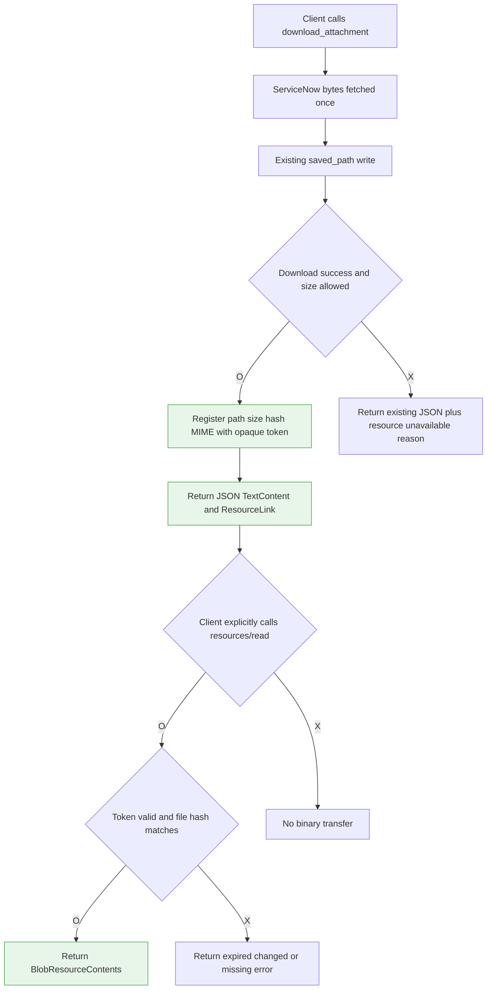
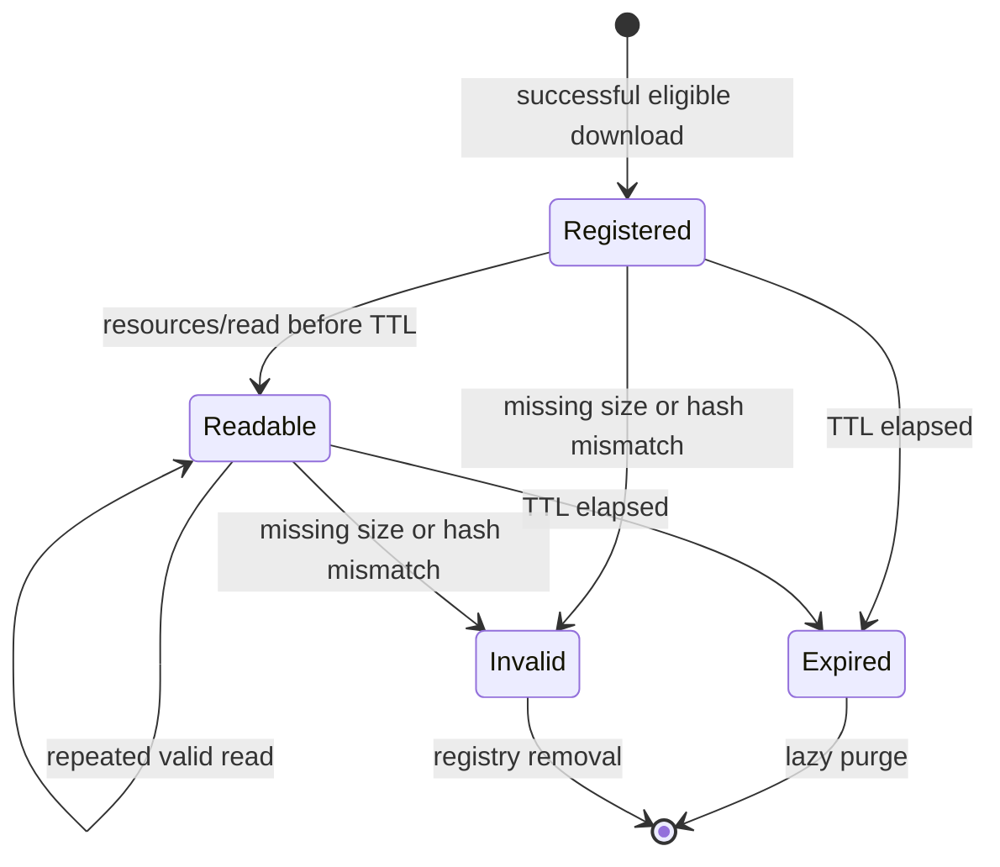
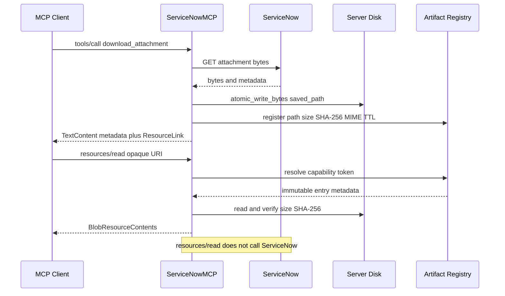

# PLAN: attachment_resource_delivery · v1

| 상태 | 작성 | 대상 | 법인 | 범위 | 근거 커밋 |
|---|---|---|---|---|---|
| 확정 | 2026-09-11 | `download_attachment` / MCP Resource 전달 | 해당 없음 | 상세 | `4ed7f51` |

> **한 줄 요약**: 기존 첨부 다운로드와 `saved_path` 계약은 유지하고, 최초 다운로드된 정확한 파일을 동일 MCP 서버에서만 후속 조회할 수 있는 만료형 `ResourceLink`로 제공한다.

> 목차: 1 배경 · 2 목표·비목표 · 3 요구사항 · 4 설계 개요 · 5 상세 설계 ·
> 6 현행 근거 · 7 대안 검토 · 8 구현 계획 · 9 검증 · 10 리스크·미결

---

## 1. 배경 & 문제 (Why)

- 현재 상황:
  - `download_attachment`는 ServiceNow Attachment REST API에서 실제 바이트를 받아 로컬 디스크에 기록하고 `saved_path`와 메타데이터만 반환한다.
  - 동일 호스트 또는 공유 볼륨 환경에서는 에이전트가 `saved_path`를 직접 읽을 수 있어 현재 방식이 가장 효율적이다.
  - MCP 서버가 별도 컨테이너 또는 원격 호스트에 있으면 반환된 경로는 서버 내부 경로이므로 MCP 클라이언트가 접근할 수 없다.
  - 서버에는 이미 `list_resources`, `list_resource_templates`, `read_resource` 핸들러가 있으나 현재는 skill 문서만 Resource로 제공한다.
- 문제·필요:
  - 문제는 ServiceNow에서 파일을 다운로드하지 못하는 것이 아니라, 이미 다운로드된 파일을 격리된 MCP 클라이언트에 전달하는 표준 경로가 없다는 것이다.
  - `return_content=true`로 base64를 기존 도구의 JSON/TextContent에 직접 포함하면 초심자가 파일 크기와 토큰 비용을 인지하지 못한 채 대규모 컨텍스트를 생성할 수 있다.
  - ServiceNow를 후속 호출에서 다시 조회하는 stateless proxy는 최초 다운로드와 후속 읽기의 인스턴스·인증 컨텍스트 또는 파일 버전이 달라질 수 있어 “다운로드한 바로 그 파일” 전달 계약이 약하다.
- 입력 근거:
  - GitHub issue `jshsakura/mfa-servicenow-mcp#98`의 원격/격리 파일시스템 문제 제기.
  - 사용자 결정: inline base64 파라미터를 추가하지 않고, 파일 내용은 별도 후속 요청으로만 가져오게 한다.
  - 사용자 결정: 후속 ServiceNow 재조회보다 최초 다운로드된 파일 자체를 전달하는 구성을 우선한다.
  - 관련 소스와 테스트는 2026-09-11, 커밋 `4ed7f51` 기준으로 조사했다.

## 2. 목표 & 비목표 (Goals / Non-Goals)

- **목표**
  - 성공한 `download_attachment` 결과는 기존 JSON 요약과 함께 MCP `ResourceLink`를 제공한다.
  - 최초 도구 응답에는 파일 base64 또는 원시 바이트가 포함되지 않는다.
  - 클라이언트가 링크를 명시적으로 `resources/read`한 경우에만 최초 다운로드된 동일 바이트를 `BlobResourceContents`로 반환한다.
  - Resource 읽기는 ServiceNow API를 다시 호출하지 않으며 다른 인스턴스·인증 정보로 재조회하지 않는다.
  - Resource URI는 로컬 경로와 ServiceNow 자격증명을 노출하지 않는 추측 불가능한 capability token을 사용한다.
  - 링크 만료, 크기 제한, 무결성 검증 및 저장소 상한을 적용한다.
  - 기존 `saved_path`, `output_dir`, 단건/다건 다운로드 및 오류 계약을 유지한다.
- **비목표 (Non-Goals)**
  - `return_content`, `content_base64` 또는 동일 의미의 도구 파라미터를 추가하지 않는다.
  - 서로 다른 MCP 서버 사이에서 ResourceLink를 공유하거나 파일을 중계하지 않는다.
  - 링크를 서버 재시작 후에도 유지하는 영속 Resource 저장소를 만들지 않는다.
  - PDF/Word/Excel 텍스트 추출 또는 문서 분석 기능을 이번 범위에 포함하지 않는다.
  - 임시 HTTPS 다운로드 엔드포인트 또는 서명 URL을 이번 범위에 포함하지 않는다.
  - ServiceNow 첨부 레코드나 원본 파일을 변경·삭제하지 않는다.
- **성공 기준**:
  - 기존 호출은 base64 없이 동일한 JSON 필드를 계속 받는다.
  - Resource를 지원하는 원격 클라이언트는 별도 `resources/read` 호출로 다운로드 당시 바이트와 동일한 파일을 받는다.
  - 만료·변조·초과 크기·알 수 없는 URI는 파일 내용을 반환하지 않고 판정 가능한 오류를 낸다.
  - 기존 attachment/resource/server 테스트와 전체 비문서 테스트가 통과한다.

## 3. 요구사항 (What)

> 무엇을 해야 하나. 판정 가능한 항목으로. 서술형 문단 금지.

| 기능 ID | 기능 | 조건(트리거) | 결과(기대 동작) | 우선순위 |
|---|---|---|---|---|
| FN-ARD-01 | 기존 다운로드 유지 | `download_attachment` 성공 | 파일은 기존 `saved_path`에 기록되고 기존 메타데이터가 유지된다 | [필수] |
| FN-ARD-02 | 지연형 링크 반환 | 성공한 파일이 Resource 허용 크기 이하 | 첫 TextContent 뒤에 해당 파일의 `ResourceLink`가 추가된다 | [필수] |
| FN-ARD-03 | 최초 응답 무바이너리 | 모든 `download_attachment` 호출 | JSON/TextContent에 base64·원시 바이트가 없다 | [필수] |
| FN-ARD-04 | 동일 파일 후속 전달 | 유효한 URI로 `resources/read` | 최초 저장 파일의 검증된 바이트를 `BlobResourceContents`로 반환한다 | [필수] |
| FN-ARD-05 | 재조회 금지 | Resource 읽기 | ServiceNow Table/Attachment API를 호출하지 않는다 | [필수] |
| FN-ARD-06 | 만료형 capability | 링크 발급 후 TTL 경과 | Resource 읽기를 거부하고 만료 오류를 반환한다 | [필수] |
| FN-ARD-07 | 무결성 검증 | 저장 파일 크기 또는 SHA-256이 발급 시점과 다름 | 바이트를 반환하지 않고 변경/손실 오류를 반환한다 | [필수] |
| FN-ARD-08 | 크기 안전장치 | 실제 다운로드 바이트가 Resource 한도 초과 | 로컬 다운로드는 성공하되 링크는 만들지 않고 사유를 JSON에 기록한다 | [필수] |
| FN-ARD-09 | 다중 첨부 | `download_all=true`이고 일부/전체 파일 성공 | 성공·허용 크기 파일마다 독립 링크를 반환한다 | [필수] |
| FN-ARD-10 | 링크 출처 고정 | 다른 MCP 서버 또는 재시작된 서버에서 URI 사용 | Resource를 찾을 수 없으며 ServiceNow로 fallback 재조회하지 않는다 | [필수] |
| FN-ARD-11 | 패키지 경계 유지 | `download_attachment`가 비활성 패키지 | attachment Resource URI를 발급하거나 읽을 수 없다 | [필수] |
| FN-ARD-12 | 저장소 상한 | 활성 링크 수가 최대 엔트리 수 초과 | 만료 엔트리를 먼저 제거하고 필요 시 가장 오래된 엔트리를 폐기한다 | [필수] |

- 제약·전제:
  - ResourceLink는 반환한 동일 MCP 서버로 다시 보내는 링크다. 다른 MCP 서버가 이 URI를 해석하는 구성은 지원하지 않는다.
  - Resource 읽기 요청에는 도구 파라미터가 없으므로 파일 크기 제한은 호출자 파라미터가 아닌 서버 정책이어야 한다.
  - 실제 MCP SDK `mcp>=1.28.1,<2`에는 `ResourceLink`와 `BlobResourceContents` 타입이 존재한다.
  - 현재 일반 tool output 예산은 코드상 기본 75,000 UTF-8 bytes이며 Resource blob에는 동일 직렬화 경로가 적용되지 않으므로 별도 hard cap이 필요하다.

## 4. 설계 개요 (Solution Overview)

- 접근 요약:
  - `download_attachment`의 파일 다운로드·저장 로직은 변경하지 않는다.
  - 서버 dispatch 계층이 성공 결과의 `saved_path`를 짧은 수명의 in-memory artifact registry에 등록하고, 기존 JSON TextContent에 이어 표준 `ResourceLink` 콘텐츠 블록을 붙인다.
  - `resources/read`는 capability token을 registry에서 찾아 저장 파일의 크기와 SHA-256을 다시 검증한 뒤 blob을 반환한다. ServiceNow 재조회와 인증 컨텍스트 재선택은 하지 않는다.
- 대표 흐름 (flowchart):

## 5. 상세 설계 (How)

- 상태 전이 (Resource entry):

- 처리 시퀀스:

- 데이터 설계:
  - 신규 내부 모델 `AttachmentResourceEntry`:
    - `token`: `secrets.token_urlsafe(32)`로 생성한 추측 불가능 식별자.
    - `path`: 발급 시 `Path.resolve()`한 절대 경로. URI에는 포함하지 않는다.
    - `file_name`, `mime_type`, `size_bytes`: ResourceLink와 blob 메타데이터.
    - `sha256`: 다운로드 완료 파일의 SHA-256. 후속 읽기 직전에 재검증한다.
    - `created_monotonic`, `expires_monotonic`: 시스템 시각 변경의 영향을 받지 않는 TTL 판정값.
    - `source_instance`: 감사·진단용 인스턴스 echo 값. 후속 ServiceNow 인증 선택에는 사용하지 않는다.
  - URI 형식: `servicenow-attachment://resource/<token>`.
  - URI는 bearer capability다. 로컬 경로, ServiceNow URL, sys_id, 자격증명을 넣지 않는다.
  - registry는 `ServiceNowMCP` 인스턴스 소유이며 모듈 전역으로 두지 않는다. 따라서 MCP 서버 인스턴스 간 링크가 섞이지 않는다.
  - 기본 정책 권고:
    - Resource 허용 실제 파일 크기: 기본 10 MiB, `SERVICENOW_ATTACHMENT_RESOURCE_MAX_MB`로 운영자 조정 가능, 절대 상한 25 MiB.
    - TTL: 15분.
    - 활성 엔트리: 최대 256개.
    - 크기 한도는 tool parameter로 노출하지 않는다. 운영자 조정이 필요하면 별도 서버 환경변수로만 제공하되 상한을 둔다.
  - 원본 `saved_path`는 기존 다운로드 결과이므로 Resource TTL 만료 시 삭제하지 않는다. registry 엔트리만 제거한다.
  - 파일 자동 삭제 정책은 기존 `download_attachment` 동작을 바꾸므로 이번 범위에서 추가하지 않는다.
- 도구 결과 조립:
  - `attachment_tools.download_attachment()`는 현재처럼 dict만 반환한다.
  - `ServiceNowMCP._call_tool_impl()`이 인스턴스 echo 처리 후, 직렬화 전에 attachment 성공 결과를 식별한다.
  - 단건은 최상위 `saved_path`; 부모 레코드/다건은 `files[]`의 `success=true`와 `saved_path`를 대상으로 한다.
  - 등록 성공 시 JSON 파일 항목에 `resource_uri`, `resource_expires_in_seconds`를 추가한다.
  - 등록 불가 시 `resource_available=false`, `resource_unavailable_reason`을 추가한다.
  - 반환 콘텐츠 순서는 기존 JSON을 담은 `TextContent` 1개, 이어서 파일별 `ResourceLink` 0개 이상이다. 추가 콘텐츠를 무시하는 기존 클라이언트는 기존 JSON을 계속 사용한다.
  - `_call_tool_impl` 반환 타입은 `list[types.ContentBlock]`에 맞게 넓힌다.
- Resource 탐색:
  - attachment capability URI는 발급된 링크로만 발견하게 하고 `resources/list`에는 나열하지 않는다.
  - opaque token은 사용자가 직접 구성할 수 없으므로 attachment `ResourceTemplate`도 광고하지 않는다.
  - `_read_resource_impl`은 `servicenow-attachment` scheme을 먼저 분기하고, 일치하지 않으면 기존 skill resource 탐색을 그대로 수행한다.
- 예외 처리:

| 조건 | 결과 |
|---|---|
| 알 수 없는 scheme/URI | 기존 `Resource not found` 오류 |
| 형식이 잘못된 attachment URI | `Invalid attachment resource URI` |
| token 미존재/서버 재시작 | `Attachment resource not found or expired` |
| TTL 경과 | 엔트리 제거 후 `Attachment resource expired` |
| 파일 삭제 | 엔트리 제거 후 `Downloaded attachment is no longer available` |
| symlink로 교체됨 | 읽지 않고 무결성 오류 |
| 실제 크기 변경 | 읽지 않고 엔트리 제거 |
| SHA-256 불일치 | blob 반환 없이 엔트리 제거 |
| Resource hard cap 초과 | 링크 미발급; 로컬 다운로드 성공 유지 |
| 패키지에 `download_attachment` 없음 | URI 읽기 거부 |

## 6. 현행 근거 (Evidence)

> 위 설계를 뒷받침하는 실물. 근거 없는 결론 금지.

- 로컬 소스:
  - `src/servicenow_mcp/tools/attachment_tools.py:142` `_download_one`: 메타데이터 크기 검사, Attachment API 호출, 응답 검증과 디스크 기록을 한 함수에서 수행한다.
  - `src/servicenow_mcp/tools/attachment_tools.py:194`: 실제 바이트가 `resp.content`에 이미 존재한다.
  - `src/servicenow_mcp/tools/attachment_tools.py:198`: 안전한 이름으로 `out_path`를 만들고 `atomic_write_bytes`로 기록한다.
  - `src/servicenow_mcp/tools/attachment_tools.py:204`: 성공 결과에 `saved_path`, 실제 `size_bytes`, MIME, 부모 정보를 반환한다.
  - `src/servicenow_mcp/tools/attachment_tools.py:262`: 단건 결과의 성공 후 raw bytes 미반환 notice를 붙인다.
  - `src/servicenow_mcp/tools/attachment_tools.py:309`: 다건 다운로드는 성공/실패 파일 dict를 `files[]`에 모은다.
  - `src/servicenow_mcp/server.py:663`: low-level MCP resource handler가 이미 등록되어 있다.
  - `src/servicenow_mcp/server.py:1152`: 현재 `resources/list`는 skill 문서만 반환한다.
  - `src/servicenow_mcp/server.py:1167`: 현재 ResourceTemplate도 skill URI만 광고한다.
  - `src/servicenow_mcp/server.py:1180`: 현재 `resources/read`는 skill URI만 해석한다.
  - `src/servicenow_mcp/server.py:1293`: tool call 반환 타입과 문서가 단일 TextContent를 전제한다.
  - `src/servicenow_mcp/server.py:1602`: tool 실행 후 multi-instance echo가 결과 dict에 적용된다.
  - `src/servicenow_mcp/server.py:1620`: 모든 일반 결과는 JSON 문자열로 직렬화된다.
  - `src/servicenow_mcp/server.py:1637`: 현재 최종 반환은 TextContent 하나뿐이다.
  - `src/servicenow_mcp/utils/response_budget.py:35`: 일반 tool output 기본 예산은 75,000 UTF-8 bytes다.
  - `pyproject.toml:37`: MCP SDK 범위는 `mcp[cli]>=1.28.1,<2`다.
  - 설치된 SDK 확인 결과 `mcp.types.ResourceLink`와 `mcp.types.BlobResourceContents`가 모두 존재한다.
- 시스템 설정:
  - ServiceNow 시스템 설정 변경 없음.
  - MCP 패키지 노출은 `config/tool_packages.yaml`의 기존 `download_attachment` 포함 여부를 그대로 사용한다.
- DB 데이터:
  - 해당 없음. 이 계획은 ServiceNow 데이터 변경 없이 `sys_attachment` 조회와 기존 Attachment REST API 응답을 사용한다.
- 충돌·확인 불가:
  - `README.md:208`은 응답 예산을 200K chars로 기술하지만 실제 기본값은 `response_budget.py:40`의 75,000 bytes다. 문서 갱신 시 실제 코드 값을 정본으로 삼아 불일치를 함께 바로잡아야 한다.
  - MCP 클라이언트별 ResourceLink 자동 노출/저장 동작은 동일하지 않으므로 구현 후 대표 클라이언트 수동 호환성 확인이 필요하다.

## 7. 대안 검토 (Alternatives)

> 고려했으나 택하지 않은 방법과 그 이유.

| 대안 | 장점 | 단점 | 채택? |
|---|---|---|---|
| 기존 `saved_path`만 유지 | 구현 없음, 토큰 비용 없음 | 격리 컨테이너·원격 클라이언트는 접근 불가 | X — issue #98 미해결 |
| `return_content=true`로 JSON base64 반환 | 거의 모든 MCP 클라이언트에서 단순 | 파라미터 하나로 대규모 컨텍스트·응답 실패 유발, 일반 TextContent에 binary 혼입 | X |
| ServiceNow 원본 stateless Resource proxy | 캐시/TTL 파일 관리가 단순 | 후속 읽기에서 재인증·재조회하며 최초 파일과 동일성을 보장하기 어려움 | X |
| 다운로드 파일 기반 만료형 ResourceLink | 최초 받은 정확한 파일 전달, 재인증 없음, 표준 pull 방식 | TTL·registry·무결성 관리 필요 | O |
| 임시 HTTPS 서명 URL | 다른 MCP/일반 HTTP 클라이언트도 파일 저장 가능 | 인증·토큰 폐기·HTTP endpoint 운영 범위가 큼 | X — 별도 과제 |
| 서버 측 문서 텍스트 추출 | LLM 분석에 가장 토큰 효율적 | 포맷별 파서와 별도 API 설계 필요, 원본 파일 전달과 다른 문제 | X — 별도 과제 |
| EmbeddedResource 즉시 반환 | MCP typed binary 사용 | 첫 도구 응답에 blob을 넣어 지연 읽기와 토큰 안전성 상실 | X |

## 8. 구현 계획 (WBS)

> 개발자가 바로 파일 열고 작업할 단위. 1 작업 = 1 행.

| 작업 ID | 구분 | 대상 | 파일 | 구현 지시 | 확인 기준 | 선행 조건 |
|---|---|---|---|---|---|---|
| WBS-ARD-01 | 신규 | Resource registry | `src/servicenow_mcp/resources/attachment_resources.py` | entry 모델, opaque URI 생성/파싱, TTL, 최대 엔트리, lazy purge를 구현한다 | token이 경로·sys_id를 노출하지 않고 만료/축출 테스트 통과 | FN-ARD-06,12 정책 확정 |
| WBS-ARD-02 | 신규 | 무결성 | `src/servicenow_mcp/resources/attachment_resources.py` | 등록 시 resolved path·size·SHA-256을 기록하고 읽기 시 일반 파일 여부·size·hash를 검증한다 | 삭제·변조·symlink 테스트에서 blob 미반환 | WBS-ARD-01 |
| WBS-ARD-03 | 수정 | 서버 초기화 | `src/servicenow_mcp/server.py` | registry를 `ServiceNowMCP` 인스턴스 멤버로 생성한다 | 두 서버 객체의 registry가 분리됨 | WBS-ARD-01 |
| WBS-ARD-04 | 수정 | Tool result adapter | `src/servicenow_mcp/server.py` | 성공한 attachment 결과의 경로를 등록하고 JSON에 URI 상태를 추가하며 TextContent 뒤 ResourceLink를 조립한다 | 단건·다건·부분 실패 결과의 링크 수가 기대값과 일치 | WBS-ARD-02,03 |
| WBS-ARD-05 | 수정 | Resource read | `src/servicenow_mcp/server.py` | attachment scheme을 분기해 registry 파일을 읽고 `BlobResourceContents`로 반환한다; ServiceNow fallback은 금지한다 | 반환 blob을 decode하면 저장 파일과 byte-equal | WBS-ARD-02,03 |
| WBS-ARD-06 | 수정 | Package gate | `src/servicenow_mcp/server.py` | `download_attachment` 비활성 패키지에서는 attachment Resource 읽기를 거부한다 | `none`/미포함 패키지 우회 접근 테스트 통과 | WBS-ARD-05 |
| WBS-ARD-07 | 테스트 | Registry unit | `tests/test_attachment_resources.py` | 등록/읽기/TTL/eviction/URI/변조/삭제/symlink/크기 제한 테스트를 추가한다 | 신규 단위 테스트 전부 통과 | WBS-ARD-01,02 |
| WBS-ARD-08 | 테스트 | Server Resource | `tests/test_server_core.py` | 기존 skill resource 회귀와 attachment blob read/not-found/package gate를 추가한다 | skill resource 테스트 변화 없이 통과 | WBS-ARD-05,06 |
| WBS-ARD-09 | 테스트 | Tool content | `tests/test_server_core.py`, `tests/test_attachment_tools.py` | 기존 JSON 필드 유지, base64 부재, 단건/다건 ResourceLink, 초과 크기 링크 미발급을 검증한다 | FN-ARD-01~10 판정 가능 | WBS-ARD-04 |
| WBS-ARD-10 | 문서 | 사용자 안내 | `README.md`, `README.ko.md`, 기타 번역본, `docs/TOOL_INVENTORY.md` | 로컬 경로/공유 볼륨/원격 ResourceLink 선택 흐름과 명시적 후속 read 비용을 문서화한다 | 생성기/미러 검증 통과 | WBS-ARD-04,05 |
| WBS-ARD-11 | 문서 자동화 | 생성 문서 | `scripts/regenerate_tool_inventory.py`, `scripts/regenerate_doc_counts.py` 실행 대상 | 프로젝트 규칙의 생성기를 실행하고 수동 count 불일치를 남기지 않는다 | docs marker 테스트 통과 | WBS-ARD-10 |
| WBS-ARD-12 | 검증 | 전체 품질 | 저장소 전체 | formatter, Ruff, mypy, attachment/resource focused tests, 전체 비문서 pytest를 실행한다 | 모든 필수 검증 성공 | WBS-ARD-01~11 |

## 9. 검증 (Validation)

### 9-1. 불변 규칙 체크

- [x] getValue 사용 — 해당 없음: ServiceNow 서버 스크립트 변경 없음
- [x] choice 소문자 — 해당 없음: choice 변경 없음
- [x] number->new_number — 해당 없음: 채번 로직 변경 없음
- [x] yoko-modal-alert — 해당 없음: 위젯 변경 없음
- [x] YKO C variant only — 해당 없음: 법인별 포털 변경 없음
- [x] 승인=sysapproval_approver — 해당 없음: 승인 로직 변경 없음
- [x] 로컬 우선·푸시 승인 — 로컬 구현만 수행했으며 원격 ServiceNow push 없음
- [x] DRY_RUN 선행 — 데이터 변경 없음
- [x] if/else 중괄호·주석 영어 — 구현 시 Python 코드와 영어 주석 기준 적용

### 9-2. 검증 절차 / 완료 정의(DoD)

- [x] 구현 중 검증: `uv run pytest tests/test_attachment_tools.py tests/test_attachment_resources.py tests/test_server_core.py -x --no-cov`
- [x] 구현 중 검증: `uv run ruff check src/ tests/`
- [x] 구현 중 검증: `uv run mypy src/`
- [x] 회귀 검증: `uv run pytest tests/ -m "not docs" -q`
- [x] 문서 검증: 프로젝트 문서 생성기 실행 후 `uv run pytest tests/ -m docs -q --no-cov`
- [x] 프로토콜 검증: 최초 `tools/call` content에 base64가 없고 `TextContent + ResourceLink` 순서임을 단위 테스트로 고정했다.
- [x] 바이트 검증: 후속 `resources/read` blob을 decode하여 저장 파일과 byte-equal임을 확인했다.
- [x] 네트워크 검증: 후속 Resource 읽기 동안 `AuthManager.make_request`가 호출되지 않음을 테스트했다.
- [ ] 격리 검증: 서버 파일 경로에 접근할 수 없는 MCP 클라이언트에서 Resource read가 가능한지 수동 확인한다.
- [x] 안전 검증: 한도 초과 파일은 로컬 저장에 성공하되 링크와 blob이 생성되지 않는다.
- [x] 완료 정의(DoD): FN-ARD-01~12가 자동 테스트로 판정되고 기존 `saved_path` 소비자가 변경 없이 동작하며 문서가 두 전달 방식을 명확히 구분한다.

## 10. 리스크 & 미결 (Risks / Open Questions)

### 10-1. 결정 요청

- [OK] Resource 기본 크기 한도는 10 MiB로 확정했다. 도구 파라미터가 아닌 운영자 환경변수로 조정하며 절대 상한은 25 MiB다. 파일 bytes는 명시적인 후속 `resources/read`에서만 반환한다.
- [OK] 링크 TTL은 에이전트의 즉시 후속 사용을 기준으로 15분, 활성 엔트리는 256개로 확정했다.
- [검토] 다른 MCP 서버나 일반 브라우저로 파일을 넘기는 요구가 확인되면 ResourceLink 범위를 넓히지 말고 인증된 임시 HTTPS 전달을 별도 과제로 분리한다.

### 10-2. 후속 운영 확인

- 설치된 최소 지원 MCP SDK 버전에서 low-level `call_tool` handler가 `TextContent`와 `ResourceLink` 혼합 리스트를 모든 지원 transport(stdio, Streamable HTTP)에서 동일하게 직렬화하는지 작은 protocol test로 고정한다.
- Streamable HTTP가 다중 사용자 서비스로 운영되는 구성이 있는지 확인한다. 있다면 opaque token만으로 충분한지, request principal/session binding을 registry key에 추가할지 보안 검토한다.
- `saved_path`가 외부 프로세스에 의해 교체될 수 있으므로 symlink 거부와 SHA-256 재검증 순서를 테스트로 먼저 고정한다.
- README의 “200K chars”와 실제 75,000 bytes 기본 응답 예산 불일치를 이번 문서 수정에 포함할지 확인한다.

### 10-3. 작업 분리

- PDF/Word/Excel 서버 측 텍스트·페이지·시트 추출 API.
- 서로 다른 MCP 서버/인증 주체 사이의 파일 전달.
- 인증된 임시 HTTPS 다운로드 endpoint 및 서명 URL.
- 서버 재시작 이후에도 유지되는 영속 Resource registry.
- 기존 다운로드 파일의 전역 보존 기간·디스크 quota·자동 삭제 정책.

### 10-4. 완료 보고

- 작성 파일: `workspace/2026-09/2026-09-11/attachment_resource_delivery/PLAN-attachment_resource_delivery_v1.md`
- 사용 입력: issue #98, 사용자 설계 결정, 로컬 attachment/resource/server 코드 및 테스트.
- 현행 확인 범위: 첨부 다운로드, MCP tool output 직렬화, skill Resource handler, 응답 예산, 관련 단위 테스트와 문서.
- 품질 게이트: 배경·목표·비목표·요구사항·상세설계·대안·WBS·검증·리스크를 현행 소스 앵커와 연결했다.
- 미결 항목: Streamable HTTP principal binding과 README 예산 표기 정합성.
- 다음 단계: 로컬 구현 검토 후 승인 시 커밋·원격 반영하고, 실제 격리형 MCP 클라이언트에서 수동 상호운용성을 확인한다.
